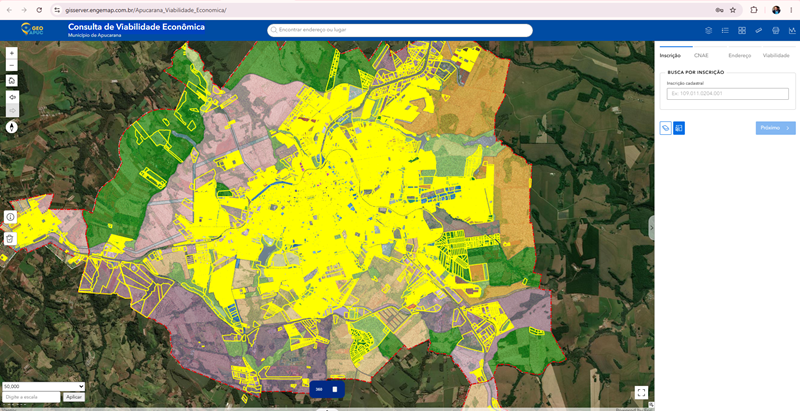

<!DOCTYPE html>  
<html lang="pt-BR">  
<head>  
    <meta charset="UTF-8">  
    <meta name="viewport" content="width=device-width, initial-scale=1.0">  
    <title>Tutorial: Consulta de Viabilidade Econômica</title>  
      
</head>  
<body>  

    <!-- CABEÇALHO -->  
    <h1>📘 Tutorial: Consulta de Viabilidade Econômica</h1>  
    
<strong>Município de Apucarana - Guia Prático de Uso</strong>
  

    
  

    <!-- ÍNDICE -->  
    <h2>📑 Índice</h2>  
    
  
        <ol>  
            <li><a href="#introducao">Introdução</a></li>  
            <li><a href="#interface">A Interface</a></li>  
            <li><a href="#legendas">Legendas e Cores</a></li>  
            <li><a href="#zoneamento">Zoneamento</a></li>  
            <li><a href="#como-buscar">Como Buscar</a></li>  
            <li><a href="#casos-praticos">Casos Práticos</a></li>  
            <li><a href="#faq">FAQ</a></li>  
        </ol>  
    
  

    
  

    <!-- INTRODUÇÃO -->  
    <h2 id="introducao">🎯 Introdução</h2>  
    
Bem-vindo ao tutorial da aplicação <strong>Consulta de Viabilidade Econômica</strong>! Esta ferramenta foi desenvolvida para ajudar você a consultar informações sobre terrenos e avaliar a viabilidade econômica de empreendimentos no município de Apucarana.
  

    <h3>O que você vai aprender:</h3>  
    <ul>  
        <li>Como acessar e navegar na aplicação</li>  
        <li>Entender o mapa interativo e suas legendas</li>  
        <li>Conhecer os diferentes zoneamentos</li>  
        <li>Realizar buscas por inscrição cadastral</li>  
        <li>Interpretar as informações de viabilidade</li>  
    </ul>  

    
  
        💡 <strong>Dica:</strong> Este tutorial leva aproximadamente 20 minutos para ser concluído. Você pode navegar pelas seções clicando no índice acima.  
    
  

    
  

    <!-- A INTERFACE -->  
    <h2 id="interface">🖥️ A Interface</h2>  

    <h3>1️⃣ O Mapa Interativo Central</h3>  
    
A parte central da tela mostra um mapa do município de Apucarana com a localização dos terrenos, zoneamentos e áreas de interesse.
  

    
  
          
        
Mapa interativo do município de Apucarana
  
    
  

    
  
        💡 Você pode ampliar (zoom) e mover o mapa usando o mouse. Use a rodinha do mouse para zoom!  
    
  

    <h3>2️⃣ O Painel Lateral Direito</h3>  
    
À direita, você encontra as abas de consulta com as seguintes opções:
  
    <ul>  
        <li><strong>Inscrição:</strong> Busca por inscrição cadastral do terreno</li>  
        <li><strong>CNAE:</strong> Atividades econômicas permitidas</li>  
        <li><strong>Endereço:</strong> Busca por localização</li>  
        <li><strong>Viabilidade:</strong> Análise de viabilidade econômica</li>  
    </ul>  

    
  
          
        
Painel lateral direito com abas de consulta
  
    
  

    <h3>3️⃣ Controles do Mapa</h3>  
    
À esquerda do mapa, você encontra os botões de controle:
  
    <ul>  
        <li><strong>+/-</strong> Zoom in e zoom out</li>  
        <li><strong>🏠</strong> Voltar para a visão inicial</li>  
        <li><strong>⬅️➡️</strong> Navegar entre visualizações anteriores</li>  
        <li><strong>⬆️</strong> Bússola / orientação do mapa</li>  
        <li><strong>ℹ️</strong> Informações</li>  
        <li><strong>🗑️</strong> Limpar seleção</li>  
    </ul>  

    <h3>4️⃣ Barra Superior</h3>  
    
Na parte superior da tela você encontra:
  
    <ul>  
        <li><strong>Logo GeoAPUC</strong> e título da aplicação</li>  
        <li><strong>Barra de busca</strong> central: "Encontrar endereço ou lugar"</li>  
        <li><strong>Ícones</strong> no canto direito: camadas, lista, grid, régua, impressora e gráfico</li>  
    </ul>  

    
  
          
        
Barra superior da aplicação
  
    
  

    
  

    <!-- LEGENDAS E CORES -->  
    <h2 id="legendas">🎨 Legendas e Cores</h2>  
    
Entenda cada elemento do mapa e o que suas cores representam:
  

    <h3>📍 Mapa Cadastral</h3>  
    <table>  
        <tr>  
            <th>Símbolo</th>  
            <th>Cor</th>  
            <th>Significado</th>  
        </tr>  
        <tr>  
            <td>🟨</td>  
            <td>Amarelo (#FFFF99)</td>  
            <td>Lotes - Terrenos e propriedades urbanas</td>  
        </tr>  
    </table>  

    <h3>🏛️ Dados da Prefeitura</h3>  
    <table>  
        <tr>  
            <th>Símbolo</th>  
            <th>Cor</th>  
            <th>Significado</th>  
        </tr>  
        <tr>  
            <td>📍</td>  
            <td>Azul (#87CEEB)</td>  
            <td>Lagos - Corpos de água e reservatórios</td>  
        </tr>  
        <tr>  
            <td>❌</td>  
            <td>Vermelho (tracejado)</td>  
            <td>Perímetro Urbano e Distrital</td>  
        </tr>  
    </table>  

    
  
          
        
Legenda completa do mapa
  
    
  

    
  

    <!-- ZONEAMENTO -->  
    <h2 id="zoneamento">📊 Zoneamento - Tipos de Uso</h2>  
    
O zoneamento define o tipo de atividade permitida em cada área.
  

    <h3>🏘️ Zoneamento Residencial (ZR)</h3>  
    <table>  
        <tr>  
            <th>Zona</th>  
            <th>Cor</th>  
            <th>Descrição</th>  
        </tr>  
        <tr>  
            <td><strong>ZR1</strong></td>  
            <td>#FFFFCC (Amarelo Claro)</td>  
            <td>Zona Residencial 1</td>  
        </tr>  
        <tr>  
            <td><strong>ZR2</strong></td>  
            <td>#FFE0B2 (Bege)</td>  
            <td>Zona Residencial 2</td>  
        </tr>  
        <tr>  
            <td><strong>ZR3</strong></td>  
            <td>#FFCC99 (Laranja Claro)</td>  
            <td>Zona Residencial 3</td>  
        </tr>  
        <tr>  
            <td><strong>ZR5</strong></td>  
            <td>#999999 (Cinza)</td>  
            <td>Zona Residencial 5</td>  
        </tr>  
    </table>  

    <h3>💼 Zoneamento Especializado (ZE)</h3>  
    <table>  
        <tr>  
            <th>Zona</th>  
            <th>Cor</th>  
                        <th>Descrição</th>  
        </tr>  
        <tr>  
            <td><strong>ZEA</strong></td>  
            <td>#ADD8E6 (Azul Claro)</td>  
            <td>Zona Especializada Administrativa</td>  
        </tr>  
        <tr>  
            <td><strong>ZEC28</strong></td>  
            <td>#FFAACC (Rosa)</td>  
            <td>Zona Especializada Comercial</td>  
        </tr>  
        <tr>  
            <td><strong>ZER28</strong></td>  
            <td>#FFAACC (Rosa)</td>  
            <td>Zona Especializada Residencial</td>  
        </tr>  
        <tr>  
            <td><strong>ZEOC</strong></td>  
            <td>#E6CCFF (Roxo Claro)</td>  
            <td>Zona Especializada de Comércio</td>  
        </tr>  
        <tr>  
            <td><strong>ZEPC</strong></td>  
            <td>#CCFFCC (Verde Claro)</td>  
            <td>Zona Especializada de Produção</td>  
        </tr>  
    </table>  

    <h3>🌳 Outros Zoneamentos</h3>  
    <table>  
        <tr>  
            <th>Zona</th>  
            <th>Cor</th>  
            <th>Descrição</th>  
        </tr>  
        <tr>  
            <td><strong>ZPC</strong></td>  
            <td>#FFAA99 (Salmão)</td>  
            <td>Zona de Proteção da Comunidade</td>  
        </tr>  
        <tr>  
            <td><strong>ZRCH</strong></td>  
            <td>#90EE90 (Verde)</td>  
            <td>Zona de Patrimônio Histórico</td>  
        </tr>  
        <tr>  
            <td><strong>ZP</strong></td>  
            <td>#FFDDAA (Amarelo Forte)</td>  
            <td>Zona de Proteção</td>  
        </tr>  
        <tr>  
            <td><strong>ZI2</strong></td>  
            <td>#CCCCCC (Cinza Claro)</td>  
            <td>Zona Industrial</td>  
        </tr>  
    </table>  

    
  
          
        
Mapa com todos os zoneamentos
  
    
  

    
  
        ⚠️ Cada zoneamento tem restrições específicas. Consulte a prefeitura para detalhes sobre o que é permitido em cada zona.  
    
  

    
  

    <!-- COMO BUSCAR -->  
    <h2 id="como-buscar">🔍 Como Buscar um Terreno</h2>  

    <h3>1️⃣ Use a Barra de Busca Superior</h3>  
    
Na parte superior, há uma barra de busca onde você pode digitar endereço ou lugar.
  

    
  
          
        
Barra de busca superior
  
    
  

    <h3>2️⃣ Busque por Inscrição Cadastral</h3>  
    
No painel lateral direito, clique na aba <strong>"Inscrição"</strong> e digite o número no campo indicado.
  
    
O formato da inscrição é:
  

    <pre><code>000.000.0000.000</code></pre>  

    
<strong>Exemplo:</strong> <code>109.011.0204.001</code> ou <code>103.068.0123.001</code>
  

    
  
        💡 Se não souber a inscrição, use a aba <strong>"Endereço"</strong> para buscar pela rua ou bairro.  
    
  

    <h3>3️⃣ Clique em "Próximo"</h3>  
    
Após digitar a inscrição, clique no botão <strong>"Próximo >"</strong> para avançar.
  

    <h3>4️⃣ Visualize o Resultado</h3>  
    
O mapa irá centralizar no lote encontrado e exibirá as informações no painel direito.
  

    
  
          
        
Resultado da busca no mapa
  
    
  

    
  
        ⚠️ Se a busca não encontrar resultado, verifique se digitou corretamente a inscrição ou endereço.  
    
  

    
  

    <!-- CASOS PRÁTICOS -->  
    <h2 id="casos-praticos">💼 Casos Práticos</h2>  

    
  
        <h3>Caso 1: Encontrar Terreno para Comércio</h3>  
        
<strong>Objetivo:</strong> Buscar lotes em zona comercial ou especializada.
  
        
<strong>Passos:</strong>
  
        <ol>  
            <li>Na legenda, identifique as zonas comerciais: <strong>ZEC28, ZEOC e ZPC</strong></li>  
            <li>O mapa mostrará as áreas correspondentes nas cores indicadas</li>  
            <li>Use a barra de busca para encontrar endereços nessas zonas</li>  
            <li>Clique no lote para ver a inscrição e viabilidade</li>  
        </ol>  
    
  

    
  
        <h3>Caso 2: Verificar Zoneamento de um Endereço</h3>  
        
<strong>Objetivo:</strong> Saber qual é o zoneamento de um terreno específico.
  
        
<strong>Passos:</strong>
  
        <ol>  
            <li>Busque o endereço na barra de busca superior</li>  
            <li>O mapa vai centralizar no local</li>  
            <li>Verifique a cor da área no mapa</li>  
            <li>Consulte a tabela de zoneamento para entender as regras</li>  
        </ol>  
    
  

    
  
        <h3>Caso 3: Identificar Propriedade pelo Cadastro</h3>  
        
<strong>Objetivo:</strong> Localizar um terreno usando sua inscrição cadastral.
  
        
<strong>Passos:</strong>
  
        <ol>  
            <li>No painel direito, clique na aba <strong>"Inscrição"</strong></li>  
            <li>Digite a inscrição: <code>109.011.0204.001</code></li>  
            <li>Clique em <strong>"Próximo >"</strong></li>  
            <li>O mapa vai centralizar no lote e exibir todos os dados</li>  
        </ol>  
    
  

    
  

    <!-- FAQ -->  
    <h2 id="faq">❓ FAQ - Perguntas Frequentes</h2>  

    
  
        <h3>Como saber a viabilidade econômica de um terreno?</h3>  
        
Após buscar o terreno, clique na aba <strong>"Viabilidade"</strong> no painel direito. Lá você encontrará informações sobre a viabilidade econômica do empreendimento.
  
    
  

    
  
        <h3>O que é CNAE?</h3>  
        
CNAE (Classificação Nacional de Atividades Econômicas) indica que tipo de atividades econômicas são permitidas naquele terreno. Exemplo: comércio, serviços, indústria.
  
    
  

    
  
        <h3>Os dados são atualizados?</h3>  
        
Sim, os dados são atualizados conforme novas informações são registradas na prefeitura.
  
    
  

    
  
        <h3>Posso usar esse mapa como prova legal?</h3>  
        
Este mapa é informativo. Para questões legais e documentos oficiais, procure a <strong>Idepplan</strong> - Instituto de Desenvolvimento, Pesquisa e Planejamento de Apucarana.
  
    
  

    
  
        <h3>A aplicação funciona em celular?</h3>  
        
Sim! A aplicação é responsiva e funciona bem em smartphones e tablets. Acesse pelo navegador do seu dispositivo.
  
    
  

    
  
        <h3>Encontrei um erro nos dados. Como reportar?</h3>  
        
Entre em contato com a Prefeitura de Apucarana através do email: <strong>suporte@apucarana.gov.br</strong>
  
    
  

    
  

    <!-- CONTATO -->  
    <h2>📞 Contato</h2>  
    
  
        
<strong>Tutorial - Consulta de Viabilidade Econômica | Apucarana - PR</strong>
  
        
📧 Email: <a href="mailto:suporte@apucarana.gov.br">suporte@apucarana.gov.br</a>
  
        
📱 Tel: (43) 3422-0000
  
    
  

    <footer>  
        
Última atualização: 2026 | Município de Apucarana - PR
  
    </footer>  

</body>  
</html>
